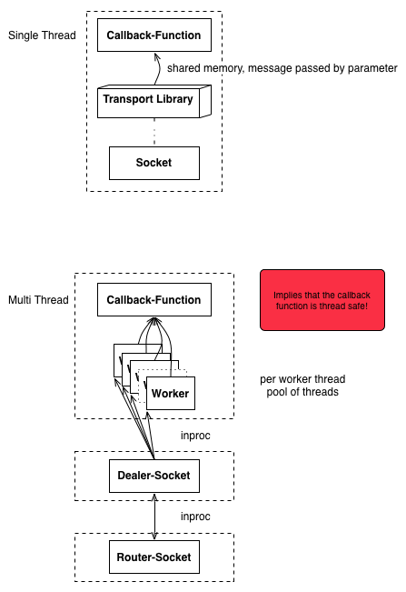

<!--
To view this document you can choose the tools of your tread:
Linux: http://sourceforge.net/p/retext/home/ReText/
Mac OS X: http://mouapp.com/
Windows: http://markdownpad.com/

This document was written in Mou, I cannot guarantee other editors
will render the file appropriately.
-->

# General

Transport Library RFC style documentation, this document describes the binding provided from the transport library to the KIARA upper layers.

For key words refer to http://www.ietf.org/rfc/rfc2119.txt

## Language

API must be in C99.

The implementation may be in C++11, without GNU or clang or MSVC extensions, do not use std::thread; or in C99.

All code must be able to be built with GCC, clang and MSVC.

Use as little third party libraries as possible (Boost) to keep the number of dependencies as low as possible.

## Memory handling

The code allocating memory is also responsible to free it.

If you cannot ensure this, you MUST provide a struct with a function freeing the memory.

```
struct foo {
	void *ptr;
	void free_foo(foo *to_be_freed);
}

…

foo.free_foo (foo);
free (foo);
```

## Multithreading

### Warning
Dmitri requires in a first step a single threaded variant of since his code is to this date (14.11.2013) not thread safe.

### Design



Threads are encapsulated in the same process environment and therefore process control block. The implication are clear: Shared resources have to be accessed with mutexes and the functions must be thread safe and also reentrant safe.

The design shows that incomming messages are dispatched to several workers, each in a separate thread. These threads then invoke a callback-function (via a function pointer) which handles the message and does some computing if necessary. The callback-function may also reply (`kt_send`) and this requires that all the later functions must be thread safe.

# Constructs

## kt_conn_session_t

```
typedef struct kt_conn_session {
	kt_conn_session_info* _info;
	void* k_user_data;
} kt_conn_session_t;
```

`k_user_data` is a pointer to an opaque data structure Dmitris Codebase need and will not be used nor modified by the network library.

## kt_msg_t

```
typedef struct kt_msg {
	std::map <std::string, std::string> metadata;
	void* payload;
	std::size_t payload_size;
	void (*free_payload) (void*);
} kt_msg_t;
```

Since `payload` is handled as a pointer to a binary memory allocation `*free_payload` is responsible to destroy/deallocate the beforementioned memory.

According to settings in `kt_conn_session_t` defined it will generate valid header and body structures from the metadata and payload when sent. The same applies the other way around when receiving messages.

## kt_connconf_t

```

// network layer
#define KT_NETWORK_LAYER uint8_t
#define KT_IPLEGACY 4
#define KT_IPV6     6

// transport layer
// see RFC 790 for numbers
// size defined RFC 790, 8 bit field
#define KT_TRANSPORT_LAYER uint8_t
#define KT_TCP    6
#define KT_UDP   21
#define KT_DCCP  33
#define KT_SCTP 132

/* TODO: This needs some more fine tuning like setting the protocol level,
 * desired algorithms, key exchanges etc.
 * <habl> 21.08.2013
 */

// crypto layer
#define KT_CRYPTO_LAYER uint8_t
#define NONE   0
#define SSL    1
#define TLS    2

// application layer
#define KT_APPLICATION_LAYER uint8_t
#define ZEROMQ  0
#define HTTP    1
#define RTSP    2
#define NTP     3
#define FTP     4
#define NFS     5

struct kt_network_stack {
	KT_NETWORK_LAYER kt_network_layer;
	KT_TRANSPORT_LAYER kt_transport_layer;
	KT_CRYPTO_LAYER kt_crypto_layer;
	KT_APPLICATION_LAYER kt_application_layer;
	// as defined by RFC 793 this field is 16 bit long
	uint16_t port;
};

/* The application type directly decides the communication pattern of the
 * socket and network and transport layers. Also it makes certain assumptions
 * that for e.g. a webserver implies HTTP with TCP on Port 80 and a streaming
 * service uses RTSP and UDP on port 554.
 */

// 8 bit allows 256 different application types, should be enough
#define KT_APPLICATION_TYPE uint8_t
#define KT_WEBSERVER   0
#define KT_PUBLISHER   1
#define KT_STREAM      2
#define KT_ROUNDROBIN  3
#define REQUESTREPLY   4

typedef struct {
	struct kt_network_stack_t network_config;
	KT_APPLICATION_TYPE kt_application_type;
	char *base_url;
} kt_connconf_t;
```

## remote endpoint

A valid remote endpoint may look like "tcp://192.168.1.1:1234" or "dds://foobar.tld:6666" and is of type char*.

The EBNF:

```
/* http://railroad.my28msec.com/rr/ui for nice railroad diagrams */
remote-endpoint ::= (protocol)? url port
protocol ::= ( "http" | "tcp"  | "udp" | "dds" )?
url ::= ( ip | hostname )
ip ::=  ipnumblock ":" ipnumblock ":" ipnumblock ":" ipnumblock ":" ipnumblock ":" ipnumblock ":" ipnumblock ":" ipnumblock
ipnumblock ::= hex hex hex hex
hostname ::= ialpha (. hostname )?
port ::= "1".."65535"

xalpha ::= (alpha | digit | safe | extra | escape)
xalphas ::= xalpha ( xalphas )?
xpalpha ::= (xalpha | "+")
xpalphas ::= xpalpha ( xpalphas )?
ialpha ::= alpha ( xalphas )?
digits ::= digit ( digits )?
safe ::= ("$" | "-" | "_" | "@" | "." | "&" | "+" | "-")
extra ::= ("!" | "*" | '"' | "'" | "(" | ")" | ",")
escape ::= "%" hex hex
hex ::= (digit | "a" | "b" | "c" | "d" | "e" | "f" | "A" | "B" | "C" | "D" | "E" | "F")

```

# Client

## kt_connect

Connect the client to a remote server

`kt_connect` requires a valid remote endpoint description according to its transport stack.

The `kt_connect` must return a kt_conn_session_t and NULL on failure.

## kt_send

Send data to the remote host

`kt_send` requires a kt_conn_session_t, a reference to a kt_msg_t and a timeout value.

The `kt_send` shall queue the message for delivery and must delete the kt_msg_t object if the delivery was successful. The return value must be 0 if successful and non-zero on failure. On failure kt_msg_t must not be destroyed.

The timeout value may define how long the sending process is allowed to take before it aborts and return a non-zero code. If the timeout is 0 `kt_send` must block until delivery is successful. However, you should nevertheless check the return code, since it may contain error indication not related to delivery.

## kt_recv

Receive data from the remote host

`kt_recv` requires a kt_conn_session and a timeout value.

The `kt_recv` must return a reference to a kt_msg_t or NULL if there was no data received. The developper has now control over the returned kt_msg_t and must destroy the received kt_msg_t object.

The timeout value may define how long the receiving process is allowed to take before it returns a NULL. If the timeout is 0 `kt_recv` must block until it received a message or an error occurred.

## kt_disconnect

Disconnects the client from a remote server.

`kt_disconnect` requires a kt_conn_session_t.

The `kt_disconnect` shall close the connection and destroy the kt_conn_session_t object, though it is the duty of the developer to destroy/free kt_conn_session_t.k_user_data object.

# Server

## kt_init_server

Configure the requirements for the server, it assumes the subjacent protocols.

`kt_init_server` requires a kt_connconf_t with at least kt_application_type set.

The `kt_init_server` shall return a kt_conn_session_t and NULL on failure. It will assume certain parameters from the underlying protocols according to the kt_connconf_t set.

Example:
```
    kt_connconf_t config;
    //set the config
    config.network_config.type = WEBSERVER;
    config.network_config.port = 8080;
    config.base_url = "*";
    
    kt_connconf_t config2;
    //set the config
    config2.network_config.crypto = TLS;
    config2.network_config.application = ZEROMQ;
    config2.network_config.type = PUBLISHER;
    config2.base_url = "10.0.1.20";
```

`config` requests a webserver usually implying TCP, HTTP and port 80. In this case the developer actively overwrites the port to be 8080.

`config2` requests a publisher (see the publish-subscribe pattern) with a ZeroMQ stack with TLS transport security listening on the IP address 10.0.1.20 with the standard ZeroMQ TCP port being 5555.

## kt_register_handle

Register a callback for handling an incoming message.

`kt_register_handle` requires a kt_conn_session_t and a thread handle, the later must be solved via preprocessor code to support different plattforms.

The `kt_register_handle` must not block.

The handle must accept a `kt_conn_session_t` and a `kt_msg_t` as parameter, and is responsible to call `kt_send` if needed.

## kt_run_server

Launch the server.

`kt_run_server` requires a kt_conn_session_t.

The `kt_run_server` may return 0 on success and non-zero on failure.

## kt_stop_server

Stops the server.

`kt_stop_server` requires a kt_conn_session_t and may contain a field stating the lingering time before killing any open request or to finish the request queue without accepting new ones (safe shutdown).

The `kt_stop_server` must return the kt_conn_session_t.k_user_data handle and it is the developers duty to destroy this object.