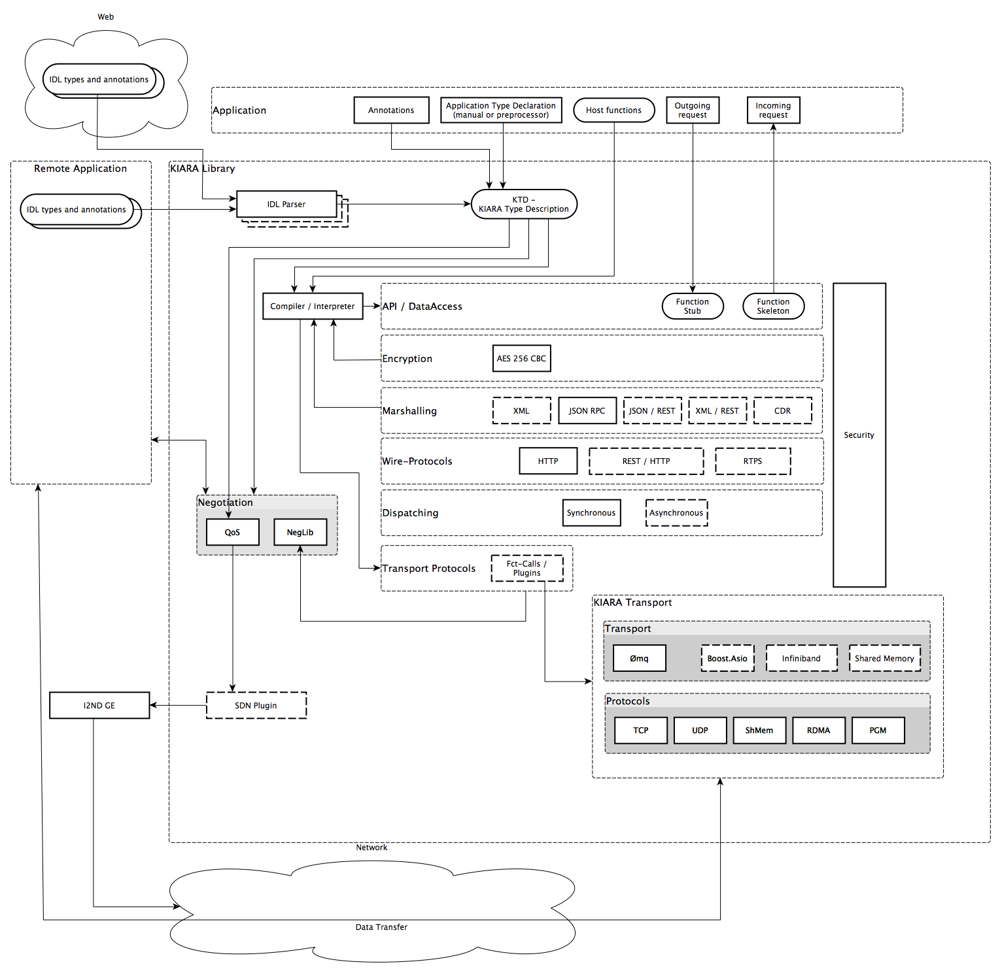
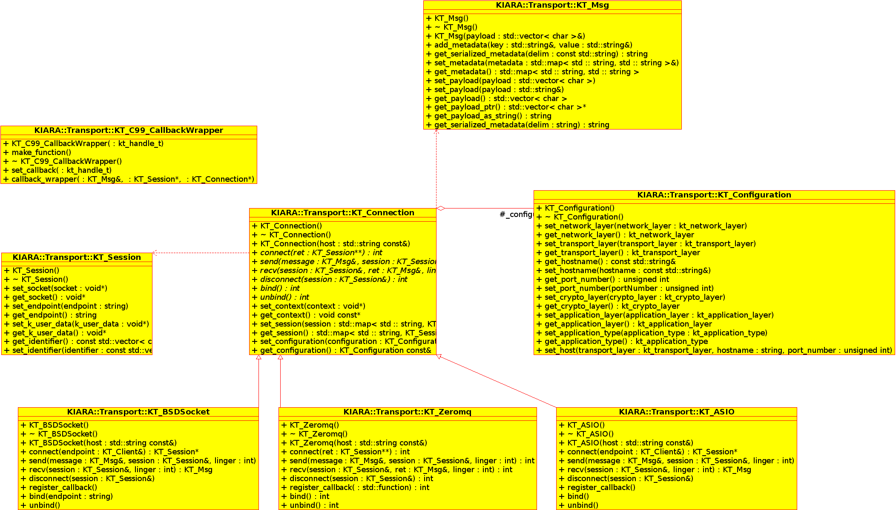
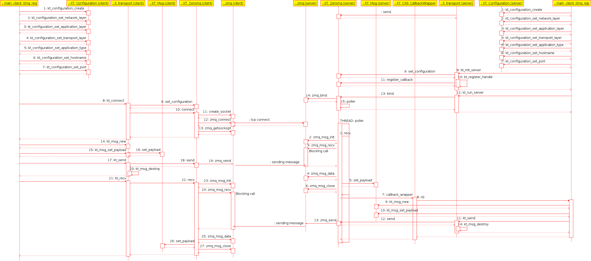

# Overview
## What is SCALN?

SCALN stands for _System Call Abstraction Layer for Networking_ and was developed by the ZHAW[^1] by three authors[^2]. The basic idea is to provide a simple API with pairs of function for network I/O:

| Setup     | Teardown   |
|-----------|------------|
| init      | destroy    |
| bind      | unbind     |
| connect   | disconnect |
| send      | recv       |

This library was initially intended to be integrated into the FI-PPP FI-Ware MiddleWare project codenamed KIARA and also as a playground for experiments with SDN[^3].

## What is SCALN not?

SCALN is not a network stack per se but makes use of them.

## Why was SCALN developed?

SCALN was developed for the purpose to have an uniform and simpler API for different network stacks. The basic idea was to provide a framework that allows to integrate rapidly new stacks, protocols, options and extensions without having to alter the source code of the core application significantly. Furthermore we wanted to ease the use of networking functions for any C developer as it usually very tedious and difficult to do so with regular POSIX sockets.

Also we wanted to be able to interoperate with an SDN controller and configure the network elements for the developers purpose and demands. Let's say the developer wants to do some low-latency, low-throughput and indicates this by a simple configuration call instead of writing the code to actually talk to the controller and possibly have to struggle with different APIs, versions and setups.

With SCALN we want to provide the next-generation of intelligent network library that is independent of a specific library or if certain requirements are met to use a purpose-specific library.

Furthermore SCALN shall up to some point be able to talk to different endpoints like server, clients and sensors, which has only a very limited subset of communication protocols.

# Outline
## Paradigms

Initially we started with the message queue based transport library ZeroMQ[^4] to be able to use strict communication paradigms like request-reply, publish-subscribe and round-robin for the middleware KIARA. In a later moment we realised also TCP_STREAM support with ZeroMQ[^5] for testing purposes.

## Protocols

Currently we support TCP, UDP and SCTP (if the operating system supports it) with ZeroMQ.

## Architectural Overview

# Discussion
## Stable features

Currently request-reply and publish-subscribe with ZeroMQ are stable features.

## Testing features, under development

There is experimental support for Infiniband and it was successfully tested but shall not be considered stable.

Support for communication protocol negotiation is under heavy development. The purpose of this is to select the best possible transport protocol for both endpoints by considering their preferences and possibilities. In a later moment the negotiation algorithm will also consider the network itself in three differen scenarios.

### Blackbox network

The most networks nowadays are more or less blackboxes and little information can be retrieved by ICMP like router hops, latency and via SNMP possibly other metrics. But most networks show little to no data at all. In this situation SCALN would be left to selective probing and measuring the network so it can find out the best (if at all) possible configuration. With these information the negotiation algorithm can make some assumptions and take some actions to improve the connectivity.

### Whitebox network, no control

In a, for instance, datacenter the network topology is known and can be retrieved by SDN or other means like SNMP. So the paths, metrics and possibly restrictions are known in advance and SCALN can chose the optimal parameters for the connection, e.g. when a path goes over a wifi bridge it is very well possible that sporadically the link experiences fast-fading attenuation and therefore it is very well possible that the wireless chip has to hold back some of the data to transmit and meanwhile the TCP retransmission kicks in trying to resend data assumed to be lost that did not leave the device at all resulting into waste of bandwidth and unnecessary retransmission and delay.

### Whitebox network, with control (fully SDN)

The third scenario is a network where it is possible to modify the route and links and also to specify the parameters of the connection. Let's assume the developer demands a high-throughput link for data transfer. In this scenario the developer would specify the required bandwidth and the SDN controller would take care of configuring the connection accordingly while choosing the most appropriate socket setup. As the latency and retransmission errors due to packet loss or corruption is not crucial the controller would prefer a longer link with a worse quality for the sake of throughput.

If the developer demands a low-latency low-throughput connection for e.g. VoIP use the controller would configure a connection over a preferably high quality link with little to no packet drop or corruption. To speed up the round trip time even further it is possible the underlying network stack is configured to use UDP instead of TCP if the link quality allows to use a connectionless transport method.

## Missing features

Integrated into KIARA code base.

Round-robin with ZeroMQ is not implemented but should be easy to do so.

boost::asio and POSIX sockets are not implemented but it should require little effort to add support for these network stacks.

# Possible Extensions

see: doc/SCALN continuation and possible extensions.pdf

# Known flaws and problems

 * `std::vector<char>` is problematic for I/O especially on the command line, started writing patches for `std::string` but never finished them.
 * a lot of memory leaks, many destructor incomplete
 * missing boundary checks, potential dangling pointers
 * pointer to internal data structures (no real encapsulation)
 * fixed size allocations, hard coded values
 * no pointer checks, unsafe pointer initialization
 * many reinterpret_casts
 * no proper error handling
 * inconsistent return value handling (rvalue/copy)
 * KT_HTTP_Parser.hpp uses `ostream& operator<<`, bad style and memory leak
 * KT_Session probably won't work with more than one instance
 * not thread safe code
 * not re-entrant safe code
 * possibly a lot of memory race conditions
 * k_transport.cpp has `goto` in it

# Glossary
[^1]: [Zürcher Hochschule für Angewandte Wissenschaften](http://zhaw.ch)
[^2]: Mathias Hablützel <habl@zhaw.ch> Philipp Aeschlimann <aepp@zhaw.ch> Sandro Brunner <brnr@zhaw.ch>
[^3]: Software Defined Networking
[^4]: [ZeroMQ](http://zeromq.org/)
[^5]: TCP_STREAM support is only very experimental in ZeroMQ and should NOT be used for real world implementation! It is strongly discouraged to use ZeroMQ for anything else than request-reply, publish-subscribe and round-robin.